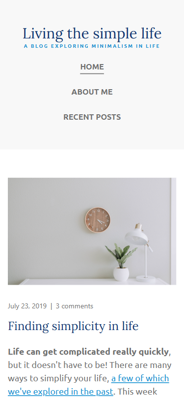
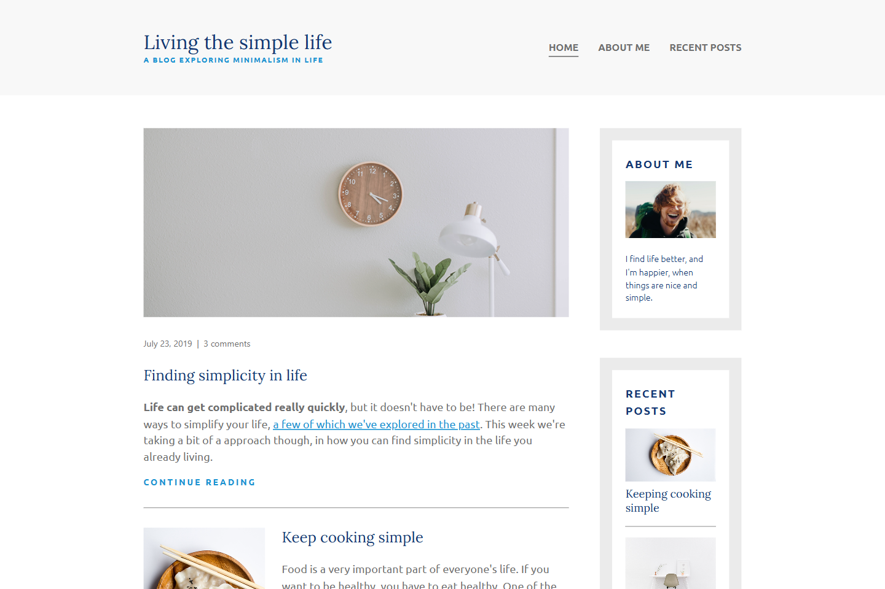

# Living the Simple Life - Personal Blog Website

## A Multi-Page Responsive Blog Layout with Semantic HTML and CSS Grid

| _Mobile Preview (375x812)_                       | _Desktop Preview (1440x960)_                        |
| ------------------------------------------------ | --------------------------------------------------- |
|  |  |

This is a simple personal blog layout built with HTML5 and CSS3. It contains three fully responsive pages that highlight personal information and blog-style entries using semantic structure, responsive design, and basic accessibility.

---

## Overview

This project is a continuation of my frontend learning path, where I practiced creating multiple HTML pages styled consistently with a single CSS file. It emphasizes layout structure using CSS Grid and mobile-first responsive techniques. The design follows clean and modern web standards with accessible HTML elements and ARIA support.

Each page shares a consistent header and footer, with main content blocks that vary based on the page's purpose. The project was built from scratch and helped me understand multi-page architecture.

---

## Features

- Responsive multi-page layout (`index`, `about-me`, and `recent-posts`)
- Semantic HTML5 structure with `<main>`, `<header>`, `<section>`, `<article>`, and `<footer>`
- CSS Grid layout with `grid-template-areas`
- Fluid typography using `clamp()`
- Mobile-first design with breakpoints for larger screens
- Navigation bar shared across all pages
- Simple card-based design for blog entries
- ARIA roles for accessibility

---

## Included Pages

- **Home (`index.html`)**  
  Displays a welcome message and latest content in a grid layout.

- **About Me (`about-me.html`)**  
  A short section describing the site's creator.

- **Recent Posts (`recent-posts.html`)**  
  A list of blog entries presented as visually distinct cards.

---

## What I Learned

- How to structure multi-page websites with shared layout elements
- Practical use of CSS Grid for entire page layout and components
- Using `clamp()` for fluid, responsive typography
- Writing accessible HTML using `role` and `aria-label`
- Creating consistent navigation across pages
- Managing styles for different screen sizes with media queries

---

## Tech Used

- HTML5
- CSS3
- Git
- GitHub
- Netlify

---

## How to Run

1. Clone the repository
2. Open `index.html` in your browser

---

## Live Demo

Or you can check out the **[live website here](https://living-the-simple-life-jiro.netlify.app/)**

---

## Author

Created by **Elmar Chavez**

Month/Year: **May 2025**

Journey: **2nd** month of learning _frontend web development_.
